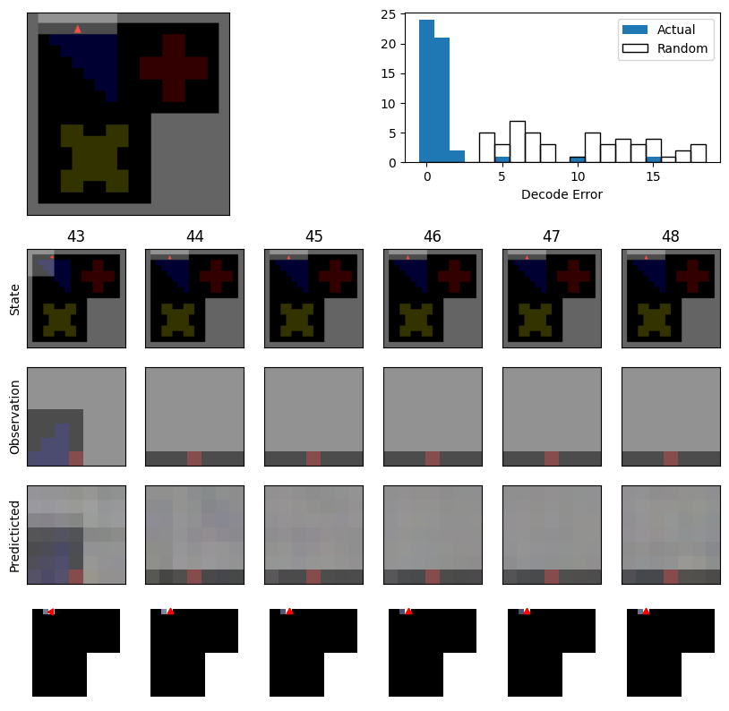
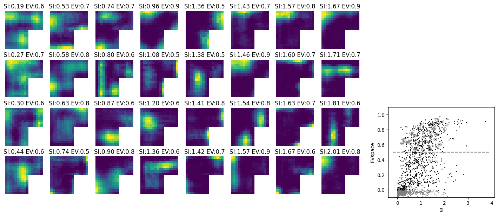
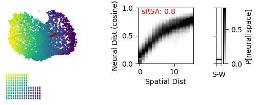
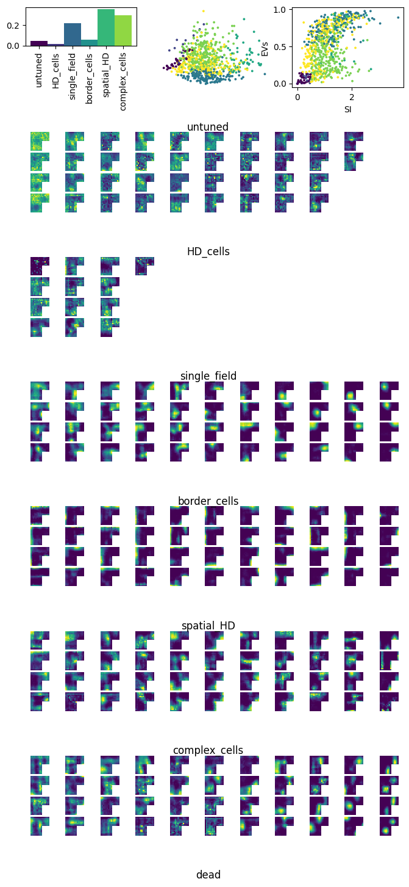

Basic Analysis with the pRNN Package
====================================

This tutorial explains how to do some basic analysis on a trained pRNN model. Note that you will need to have already trained a pRNN model to follow along with this tutorial. A partially-trained model works as well; if you have a ``.pkl`` file, you can load it using the ``PredictiveNet.loadNet`` method. If you don't, please refer to the :ref:`training tutorial <training_nets>` documentation.

In the tutorial, you will load a pre-trained network, calculate spatial representations, evaluate decoding performance, and generate visualizations of the network's cognitive map properties. We have provided a ``BasicAnalysis.ipynb`` notebook in the examples folder if you'd like to run this analysis interactively, or a ``BasicAnalysis.py`` script, which can be run on a compute cluster. We recommend using a GPU with at least 16GB for these scripts.

Imports and Setup
-----------------

The analysis script imports necessary utilities from the pRNN package, as well as standard data science libraries:

.. code-block:: python

    import numpy as np
    import pandas as pd
    import matplotlib.pyplot as plt

    from prnn.utils.predictiveNet import PredictiveNet
    from prnn.utils.agent import RandomActionAgent
    from prnn.analysis.SpatialTuningAnalysis import SpatialTuningAnalysis
    from prnn.analysis.representationalGeometryAnalysis import representationalGeometryAnalysis
    from prnn.analysis.OfflineTrajectoryAnalysis import OfflineTrajectoryAnalysis

The key analysis classes are ``SpatialTuningAnalysis``, ``representationalGeometryAnalysis``, ``OfflineTrajectoryAnalysis``. These are used to calculate tuning curves and other single-cell analysis of spatial representation in the network, investigate the population-level geometry of the spatial representation, and investigate decoded offline trajectories (replay) in the network. 

Let's first set the folder where all figures will be saved:

.. code-block:: python

    savefolder = 'BasicAnalysisFigs'

Loading the Network and Environment
------------------------------------

First, we load our trained pRNN model and retrieve the environment it was trained in:

.. code-block:: python

    #Example Net
    netname = 'Masked'
    netfolder = '/maskedk_panel/'
    exseed = 8
    predictiveNet = PredictiveNet.loadNet(netfolder+netname+'--s'+str(exseed))

The ``netname`` and ``netfolder`` variables specify the path to the trained network (you might need to change these to match what's saved on your machine). The ``exseed`` parameter identifies a specific training seed. The ``EnvLibrary`` attribute of the ``predictiveNet`` object contains the environments the network was trained on. We retrieve the first environment:

.. code-block:: python

    env = predictiveNet.EnvLibrary[0]

Setting Up the Agent
--------------------

Next, we define an agent that will interact with the environment during analysis. We use a ``RandomActionAgent`` with specific action probabilities:

.. code-block:: python

    agentname = 'RandomActionAgent'
    # action space: turn left, turn right, move forward, pause, pick up item, use item, drop item? 
    action_probability = np.array([0.15,0.15,0.6,0.1,0,0,0])
    agent = RandomActionAgent(env.action_space,action_probability)

The ``action_probability`` array defines how likely each action is to be selected. In this case, forward movement (action 3) has a 60% probability, while rotations and other actions have lower probabilities. These probabilities should match the action space of your environment.

Calculating Spatial Representation
-----------------------------------

The core of the analysis is to extract the network's spatial representation. We train a linear decoder to map hidden unit activations to position:

.. code-block:: python

    place_fields, SI, decoder = predictiveNet.calculateSpatialRepresentation(env,agent,
                                                 trainDecoder=True)

This function:

- Generates an agent trajectory through the environment, this is 15000 by deafult, and should be long enough that the agent thoroughly covers the environment, visiting each posisition multiple times from different directions. You can set this using ``timesteps=XXXX`` as appropriate for different environments.
- Collects the network's hidden state activations at each position
- Trains a linear decoder to predict position (in the environment) from hidden unit states. This will also be used later to decode the represented position during sleep periods.
- Returns ``place_fields`` (the spatial tuning of individual neurons), ``SI`` (spatial information for each neuron's tuning curve), and the trained ``decoder`` object

Evaluating Decoding Performance
--------------------------------

Once the decoder is trained, we evaluate how well the network's representations can be decoded to recover position. This makes use of the ``decoder`` trained in the previous step:

.. code-block:: python

    predictiveNet.calculateDecodingPerformance(env,agent,decoder,
                                                savename=netname, savefolder=savefolder,
                                              trajectoryWindow=5,
                                              timesteps=1000)

This function generates a new "test" trajectory and computes decoding error over time. The ``trajectoryWindow`` parameter sets the window for decoding, and ``timesteps`` specifies how long the trajectory is. Results are saved to ``savefolder`` with the filename based on ``savename``.

- Top row: (left) the trajectory taken of length trajectoryWindow, (right) distribution of decoder error compared to random shuffled data. Should show low decoder error for the actual data.
- State: shows actual action sequences across 6 sequential time steps.
- Observation: shows the egocentric view of the agent for the same 6 sequential timestemps.
- Predicted: the predicted observation for that timestep from the linear decoder returned in the above cell
- Bottom row: predicted global location for that timestep from the linear decoder.

Spatial Tuning Analysis
-----------------------

The ``SpatialTuningAnalysis`` class examines individual neuron tuning curves and produces comparison figures:

.. code-block:: python

    STA = SpatialTuningAnalysis(predictiveNet,inputControl=True, untrainedControl=True)
    STA.TCExamplesFigure(netname,savefolder)

By setting ``inputControl=True`` and ``untrainedControl=True``, the analysis generates control comparisons. The ``TCExamplesFigure`` method creates a figure showing example tuning curves for neurons, as well as the spatial info and variance explained by position (EV_space) for each neuron, and saves it with the specified name to the save folder. This helps visualize which neurons develop spatial tuning and how selective they are. These are saved in the STA object if you need them for further analysis or comparison between networks - feel free to open up the ``SpatialTuningAnalysis.py`` file to see what else is stored there.

Representational Geometry Analysis
-----------------------------------

The representational geometry analysis examines the structure of the network's representational space, particularly comparing activity during wake (active exploration) and sleep (spontaneous offline replay):

.. code-block:: python

    sleepnoise = 0.03
    isomap_neighbors = 15
    RGA = representationalGeometryAnalysis(predictiveNet, noisestd=sleepnoise,
                                           withIsomap=True, n_neighbors = isomap_neighbors)
    RGA.WakeSleepFigure(netname,savefolder)

Isomap visualization of population activity in the network in which units assigned to represent nearby positions are connected with recurrent excitation and those representing distant positions are mutually inhibiting. Each point represents a population activity vector at a point in time, colored by the position of the agent (wake), with sleep timepoints in red. Spatial representational similarity analysis (sRSA) measures the correlation between spatial and neural activity distances, while Sleep-Wake distance (SW Dist) measures the neural distance between sleep and wake activity in the network.  

The ``noisestd`` parameter controls the standard deviation of noise added to the network during offline analysis (simulating spontaneous activity). The ``n_neighbors`` parameter specifies how many neighbors are used in the Isomap dimensionality reduction. The ``WakeSleepFigure`` method generates a visualization comparing the structure of representations during wake and sleep states. This also calculates the networks spatial-representational similarity analysis (sRSA), or correlation between distance in space and (cosine) distance in neural space, which is contained in the RGA object.

Tuning Curve Analysis and Cell Types
------------------------------------
The ``TuningCurveAnalysis`` class takes in a predictiveNet object and classifies units based on their tuning curve properties.

Upper left shows you the percentage of the network per class type. Middle shows a PCA embedded of the various features used to classify each unit, colored by their group ID. Right shows EVs versus SI for each unit, again colored by cell type. Below are example tuning curves for each cell class. The cell types include: 
- untuned
- HD_cells: head direction cells, units with a preference for head direction but no spatial preference 
- single_field: a canonical "place cell" with a centralized symetric place field
- border_cells: units that fire preferentially along environmental boundaries
- spatial_HD: some combination of spatial and head direction preferences
- complex_cells: units that have high SIs but cannot be categorized into the above types 
- dead: occasionally you will get units that have no activity 

Offline Trajectory Analysis with Adaptation
--------------------------------------------

The ``OfflineTrajectoryAnalysis`` class analyzes spontaneous trajectories generated by the network during offline (sleep-like) activity. The first instantiation examines trajectories with cellular adaptation:

.. code-block:: python

    b_adapt = 1
    tau_adapt = 100
    OTA_adapt = OfflineTrajectoryAnalysis(predictiveNet, noisestd=sleepnoise,
                                       withIsomap=False, decoder=decoder, 
                                          withAdapt=True, b_adapt = b_adapt, tau_adapt=tau_adapt,
                                           compareWake=True)
    OTA_adapt.SpontTrajectoryFigure('adaptation',savefolder, trajRange=(150,250))

The ``trajRange`` parameter specifies which portion of the trajectory to visualize. Setting ``withAdapt=True`` turns on adaptation in the network units, and ``b_adapt`` and ``tau_adapt`` parameters control the adaptation strength and timescale. Note that adaptation takes the following form:

.. math::

    h_t = \mathrm{AdaptNormReLU}\left(W_{rec} h_{t-1} + W_{in} o_t + W_{act} a_t, c_t\right)
    c_t = (1 - \frac{1}{\tau_{adapt}}) c_{t-1} + \frac{b_{adapt}}{\tau_{adapt}} h_{t-1}

Offline Trajectory Analysis with Action-Based Query
----------------------------------------------------

The second offline trajectory analysis examines trajectories generated when the network receives action (speed+HD) queries:

.. code-block:: python

    OTA_query = OfflineTrajectoryAnalysis(predictiveNet, noisestd=sleepnoise,
                                   withIsomap=False, decoder=decoder,
                                         actionAgent=True,
                                   compareWake=True)
    OTA_query.SpontTrajectoryFigure('actionquery',savefolder, trajRange=(110,150))

Here, ``actionAgent=True`` means the network receives random action inputs during the offline trajectory, which will direct how it moves through the environment.

Running the Analysis
--------------------

To run the basic analysis script, simply execute:

.. code-block:: bash

    python BasicAnalysis.py

You may wish to submit this on a gpu cluster if your network is large or your environment complex. This will speed things up:

.. code-block:: bash
    #!/bin/bash

    #SBATCH --job-name=basic_analysis
    #SBATCH --output=logs/BA_%j.out
    #SBATCH --error=logs/BA_%j.err
    #SBATCH --time=6:00:00
    #SBATCH --partition=gpu
    #SBATCH --gpus=1

    cd ~
    module load miniconda
    conda activate base39
    source ~/venvs/PredictiveReplay_39/bin/activate

    cd project/pRNN
    python BasicAnalysis.py

Make sure to adapt this to your particular environment. All generated figures will be saved to the ``BasicAnalysisFigs/`` directory. The script will generate several comparison figures showing tuning curves, representational geometry, and offline replay trajectories. This provides a comprehensive view of the network's learned cognitive map and its ability to support both online perception and offline spatial reasoning.

