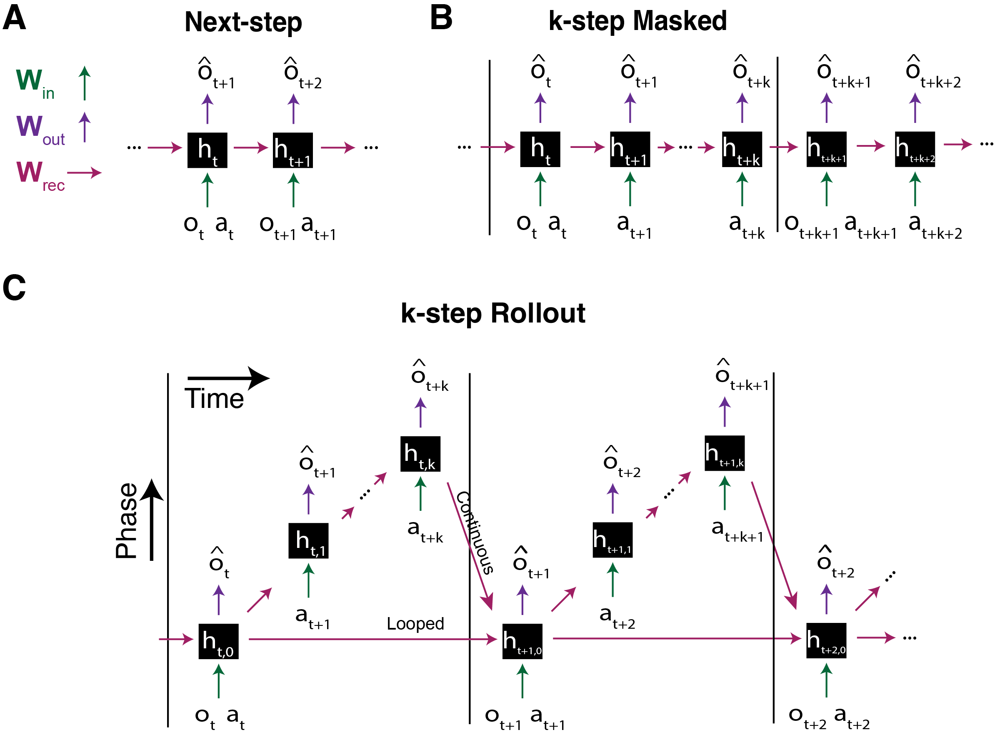

Models
======

There are three types of models we focus on here. All are built upon the same class :class:`prnn.utils.Architectures.pRNN`, which initializes weights, chooses a base :class:`prnn.utils.thetaRNN.RNNCell` type, restructrures inputs, and runs a forward pass to generate predictions. The models below augment this base structure, by altering which agent observations and actions are visible when.

    The three types of predictive networks supported by the package.

Next-step Prediction
--------------------

The Next-step prediction class :class:`prnn.utils.Architectures.NextStepRNN` is an instantiation of :class:`prnn.utils.Architectures.pRNN` that uses the observation and action at timestep t to predict a future observation.

.. autoclass:: prnn.utils.Architectures.NextStepRNN
    :members:
    :undoc-members:
    :show-inheritance:

A Next-step pRNN can be defined similar to the Masked net in :doc:`quickstart <quickstart.rst>`:

.. code-block:: python

    #Make a pRNN
    num_neurons = 500
    pRNNtype = 'NextStep'
    predictiveNet = PredictiveNet(env, hidden_size=num_neurons, pRNNtype=pRNNtype)

When constructing a Next-Step pRNN, you can specify several parameters:

- **predOffset**: How many steps forward to predict. predOffset=1 (default) predicts the observation at t+1 given inputs at t. predOffset=0 reconstructs the current observation (autoencoding).
- **use_FF**: Whether to remove recurrence and use a purely feed-forward architecture (True) or maintain recurrent connections (False, default). When True, the hidden-to-hidden weight matrix is zeroed out, eliminating the influence of previous hidden states.

Masked Prediction
-----------------

The Masked prediction class :class:`prnn.utils.Architectures.MaskedRNN` is an instantiation of :class:`prnn.utils.Architectures.pRNN` that applies a periodic masking pattern to observations such that the model must rely on its hidden state and learned dynamics to maintain predictions.

.. autoclass:: prnn.utils.Architectures.MaskedRNN
    :members:
    :undoc-members:
    :show-inheritance:

When constructing a Masked pRNN, you can specify several parameters:

- **k**: The length of each masked sequence. The model sees an observation once every (k+1). The model produces predictions for current obersations (o at t) at all timesteps.
- **mask_actions**: Whether to also mask actions using the same periodic pattern as observations (True), or allow the model access to the full action sequence during blind periods (False, default).
- **actOffset**: The temporal offset for actions. actOffset=0 (default) means at timestep t, the model uses the action from t. actOffset=1 means at timestep t, the model uses the action from t-1 (the action that produced the current observation).

Rollout-based Prediction
------------------------

The Rollout-based prediction class :class:`prnn.utils.Architectures.RolloutRNN` is an instantiation of :class:`prnn.utils.Architectures.pRNN_th` that, at every timestep t, predicts future observations for k steps ahead before receiving sensory input, creating a "rollout" of predictions.
.. autoclass:: prnn.utils.Architectures.RolloutRNN
    :members:
    :undoc-members:
    :show-inheritance:

When constructing a Rollout pRNN, you can specify several parameters:

- **k**: The number of steps to predict into the future at each timestep. During a k-step rollout from timestep t, the model generates predictions for observations at t+1, t+2, ..., t+k.
- **rollout_action**: How the model uses actions during rollout predictions:

    - "full": Use the actual action sequence that will be used in timesteps t+1, t+2, ..., t+k during predictions
    - "first": Repeat the action from t+1 that will be taken throughout the entire rollout
    - "hold": Repeat the action from timestep t that was just taken throughout the entire rollout

continuousTheta: Controls which hidden state initializes the forward pass at the next real timestep. If ``True``, the hiddne state from the end of the k-step rollout becomes the starting state for the next real timestep. If ``False``, it reverts to the pre-rollout state. 
.. code-block:: python

    #Make a pRNN
    num_neurons = 500
    pRNNtype = 'Rollout' 
    predictiveNet = PredictiveNet(env, hidden_size=num_neurons, pRNNtype=pRNNtype, k = 5, continuousTheta = False)

Let's take a look at the hidden unit activations in the rollout network:

.. code-block:: python

    obs, act, _, _ = predictiveNet.collectObservationSequence(env,agent,10,discretize=True)
    obs_pred, obs_next, h  = predictiveNet.predict(obs,act, fullRNNstate=False)
    print(h.shape)

For the :class:`prnn.utils.Architectures.NextStepRNN` and :class:`prnn.utils.Architectures.MaskedRNN`, the shape of ``h`` will be ``[1, T, N]`` where ``T`` is the number of timesteps, and ``N`` is the number of neurons in the network. In the case of :class:`prnn.utils.Architectures.RolloutRNN`, the shape of ``h`` will be ``[k+1, T, N]`` where ``k`` is the number of rollout steps. 

Also recall that ``h.shape`` will return ``[k+1, T, N]`` without batching and ``[k+1, T, N, B]`` when trained from a dataset with batching, where ``k`` is the number of rollout predictions per timestep. 

Sparse-lognormal pRNN
---------------------

In addition to specifying various arguments for the architectures, you can also specify arguments to configure the initialization scheme (i.e. the ``init`` argument). Using sparse connectivity, with weights drawn from a lognormal distribution gives notably better place cells.

.. code-block:: python

    #Make a pRNN
    num_neurons = 800
    pRNNtype = 'Rollout' 
    predictiveNet = PredictiveNet(env,
                                hidden_size=num_neurons,
                                pRNNtype=pRNNtype,
                                k = 5,
                                init = "log_normal",
                                sparsity = 0.05, #95% connectivity or 5% of connections are zero
                                eg_weight_decay=1e-8,
                                eg_lr=2e-3,
                                bias_lr=0.1)

This will initialize weights with values sampled from a log-normal distribution. Note that, if we would like to use log-normal initialization, we should specify a few extra parameters relating to the exponentiated gradient (EG) descent algorithm. It's a learning algorithm that preserves skewed (positive) log-normal weight distributions, sparse connectivity, and Dale's Law. See the `related paper <https://www.biorxiv.org/content/10.1101/2024.10.25.620272v1>`__ for more details. The ``sparsity`` parameter handles the degree of this sparse connectivity. 

By default, however, the weights will instead be initialized with the Xavier/Glorot scheme (i.e. drawn from a scaled uniform distribution).
