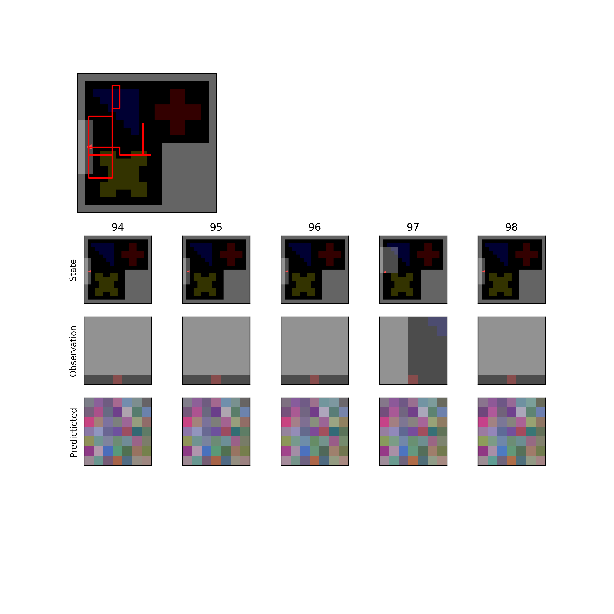
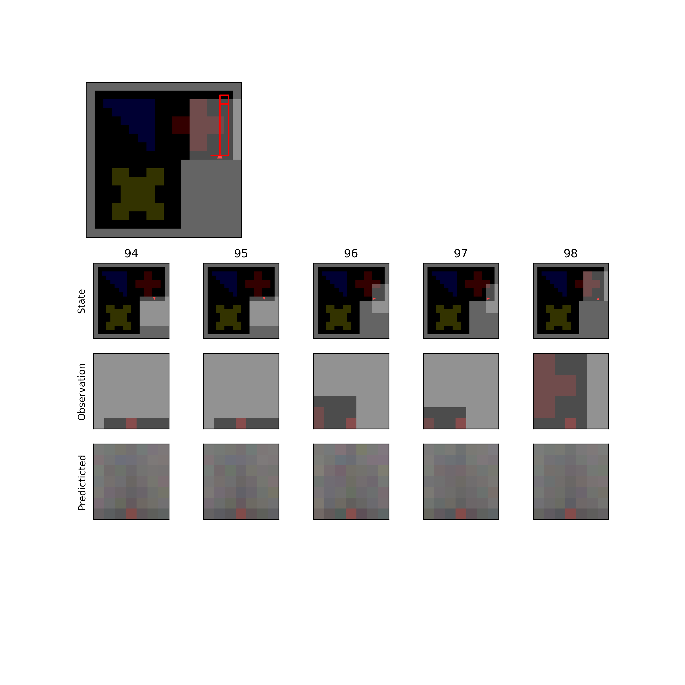
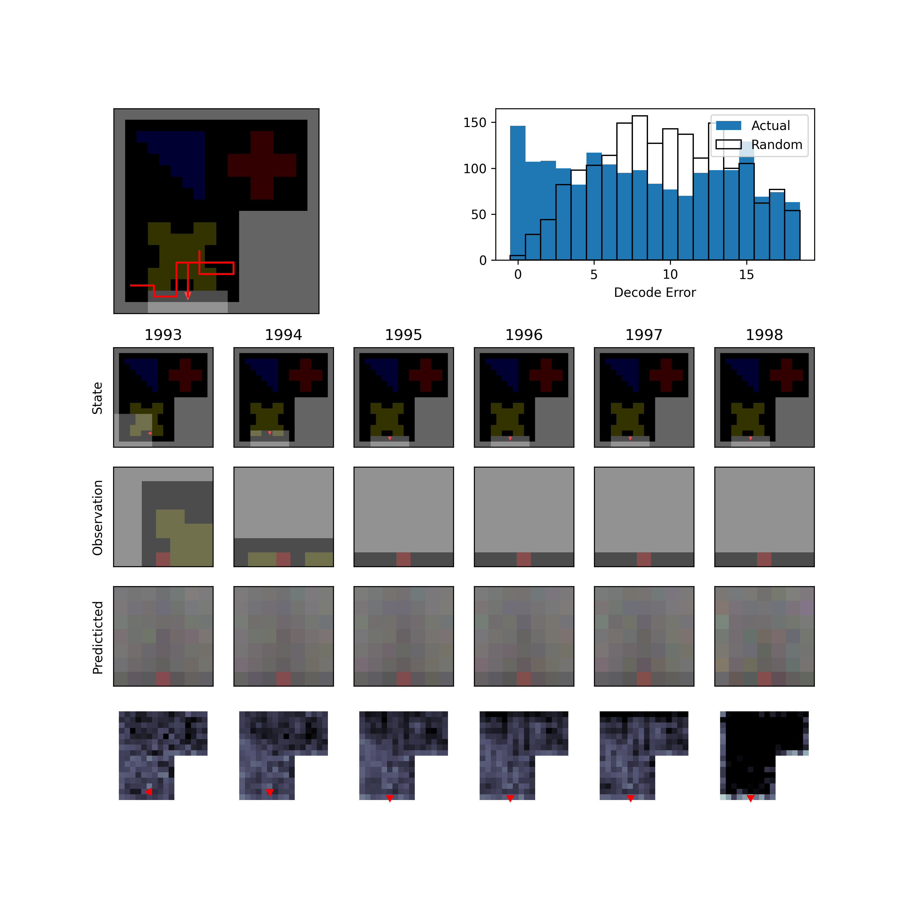
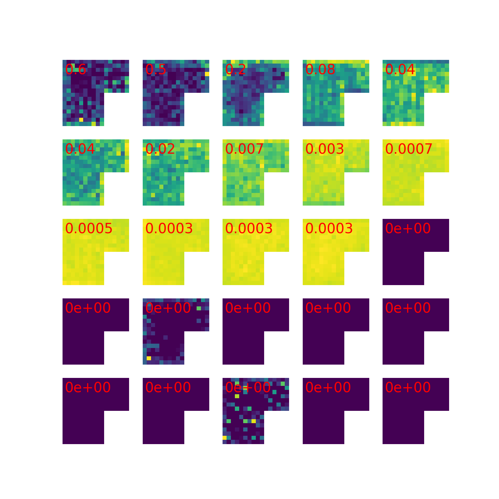
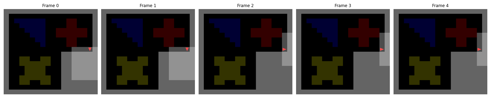

Getting Started
===============

This quickstart guide will help you train a pRNN model. We've implemented ``tutorial.ipynb`` in the package repo, so that you may run the preliminary analysis yourself.

We'll first import the ``predictiveNet`` class, which contains the machinery to train a ``pRNN`` model. We also import ``make_env`` and ``RandomActionAgent`` from ``utils``. Environments are made to manage different scenarios in which ``pRNNs`` are trained in, varying by world environment package (e.g. gym-minigrid, farama-minigrid, Rat-in-a-Box, miniworld, etc), encoding of actions, and observation type. The ``RandomActionAgent`` will return a sequence of random actions for the egocentric agent to use while navigating the environment specified with ``make_env``. 

.. code-block:: python

    #import the pRNN class
    from prnn.utils.predictiveNet import PredictiveNet

    from prnn.utils.env import make_env
    from prnn.utils.agent import RandomActionAgent

    import matplotlib.pyplot as plt
    import numpy as np

.. code-block:: text

    wandb not installed, will not log to wandb

Here, we specify which package will generate the world environment (here ``gym-minigrid``), and in which particular setting the agent will be placed in (here ``MiniGrid-LRoom-18x18-v0``). For this particular run, we'll also specify the encoding scheme for the actions. Head direction (forward, left, right, backwards) is one-hot encoded, and we also store agent speed. (#TODO confirm size).

.. code-block:: python

    #Make a gridworld environment
    env_package = 'gym-minigrid' 
    env_key = 'MiniGrid-LRoom-18x18-v0'
    act_enc = 'SpeedHD' #actions will be encoded as speed and one hot-encoded head direction

    env = make_env(env_key=env_key, package=env_package, act_enc=act_enc)

We specify the agent parameters:

.. code-block:: python

    #specify an action policy (agent)
    action_probability = np.array([0.15,0.15,0.6,0.1,0,0,0])
    agent = RandomActionAgent(env.action_space, action_probability)

Next, we construct the pRNN model. Note that the ``predictiveNet`` class recieves both the ``env`` variable as well as the type of pRNN we're training. See the "Models" page for an explanation of which models are supported, as well as ``Architectures.py`` for a full list. Generally, we focus on three types: next-step prediction models, masked prediction models, and rollout models. Here, we choose to construct a pRNN with five timestep observations masked. If we set ``pRNNtype = "Masked"``, we may also like to provide additional keyword arguments to further specify the model; such as ``inMask_length``, which sets the number of future observations that are masked, and ``useLN`` which determines whether or not to apply LayerNorm.

.. code-block:: python

    #Make a pRNN
    num_neurons = 500
    pRNNtype = "Masked"
    predictiveNet = PredictiveNet(env, hidden_size=num_neurons, pRNNtype=pRNNtype, k = 5, use_LN = True)

Once the environment, agent, and network have been defined, it's possible to plot a sample trajectory to provide an example of actions and observations. The following lines will plot the agent in the environment, show it's egocentric view, and what it's prediction is for that timestep. Note that the pRNN has not been trained yet, so predictions will be noisy dependent on the initialization scheme. By default, weights are initialzied uniformly according to the Xavier initialization scheme.

.. code-block:: python

    #run a sample trajectory (note: predictions will be garbage, agent is untrained)
    predictiveNet.plotSampleTrajectory(env,agent)
    plt.show()

    The agent's predictions are all noise.

We can finally begin to train the network, after specifying some hyperparameters. Here, we set both hyperparameters to 50 for the sake of a quick(er) example run. We aren't expecting any major performance increases with this. These two hyperparameters should ideally be set upwards of 500. That step may take a while!

.. code-block:: python

    #Run one training epoch of 500 trials, each 500 steps long
    sequence_duration = 50
    num_trials = 50

    predictiveNet.trainingEpoch(env, agent,
                            sequence_duration=sequence_duration,
                            num_trials=num_trials)

.. code-block:: text

    Training pRNN on cpu...
    loss: 0.028, sparsity: 3.9, meanrate: 0.38 [    0\   50]
    loss: 0.022, sparsity: 3.9, meanrate: 0.39 [    5\   50]
    loss: 0.02, sparsity: 3.9, meanrate: 0.39 [   10\   50]
    loss: 0.016, sparsity: 3.9, meanrate: 0.39 [   15\   50]
    loss: 0.019, sparsity: 4.0, meanrate: 0.39 [   20\   50]
    loss: 0.017, sparsity: 4.0, meanrate: 0.39 [   25\   50]
    loss: 0.018, sparsity: 3.9, meanrate: 0.39 [   30\   50]
    loss: 0.016, sparsity: 4.0, meanrate: 0.39 [   35\   50]
    loss: 0.017, sparsity: 4.0, meanrate: 0.4 [   40\   50]
    loss: 0.015, sparsity: 4.0, meanrate: 0.4 [   45\   50]
    loss: 0.016, sparsity: 4.0, meanrate: 0.39 [   49\   50]
    Epoch Complete. Back to the cpu

After the network trains, we can plot another sample trajectory to compare true and predicted observations. Did they get better? Training for more epochs should improve this performance. We can also inspect how spatial position is decoded, along with a panel of tuning curves.

.. code-block:: python

    #run a sample trajectory. did the predictions get better? 
    predictiveNet.plotSampleTrajectory(env,agent)
    plt.show()

    #Let's take a look at the spatial position decoding and tuning curves 
    place_fields, SI, decoder = predictiveNet.calculateSpatialRepresentation(env,agent,
                                                    trainDecoder=True, saveTrainingData=True)

    predictiveNet.calculateDecodingPerformance(env,agent,decoder)
    predictiveNet.plotTuningCurvePanel()

.. code-block:: text

    Training Decoder on cpu...
    loss: 5.870765 [    0\ 5000]
    loss: 4.540343 [  500\ 5000]
    loss: 4.259828 [ 1000\ 5000]
    loss: 4.078527 [ 1500\ 5000]
    loss: 3.957789 [ 2000\ 5000]
    loss: 3.872919 [ 2500\ 5000]
    loss: 3.810321 [ 3000\ 5000]
    loss: 3.761265 [ 3500\ 5000]
    loss: 3.684167 [ 4000\ 5000]
    loss: 3.669147 [ 4500\ 5000]
    loss: 3.618855 [ 4999\ 5000]
    Training Complete. Back to the cpu

The agent's predictions are still noisy, but we can see the predictions more informed by the egocentric perspective. Note that ``calculateSpatialRepresentation`` calls ``collectObservationSequence`` which generates a sequence of agents observations and actions and ``predict`` which does the forward pass (generating an predicted observation and updated hidden state). It's important to understand how the shape of the model's state changes given the type of network used. Running the below will be informative. Here, we collect 10 timesteps of information, then do a forward pass.

.. code-block:: python

    obs, act, state, render = predictiveNet.collectObservationSequence(env,agent,10,discretize=True)
    obs_pred, obs_next, h  = predictiveNet.predict(obs,act, fullRNNstate=False)
    print(h.shape)

The shape of the hidden state, ``h``, depends on whether the model batches, and on whether rollouts are performed. For the :class:`prnn.utils.Architectures.NextStepRNN` and :class:`prnn.utils.Architectures.MaskedRNN`, the shape of ``h`` will be ``[1, T, N]`` where ``T`` is the number of timesteps, and ``N`` is the number of neurons in the network. If we train with batching (call this ``B``), an extra dimension gets added to the end ``[1, T, N, B]``. In the case of :class:`prnn.utils.Architectures.RolloutRNN`, the shape of ``h`` will be ``[k, T, N, B]`` where ``k`` is the number of rollout steps. Note that ``state`` is not the same as ``h``. The ``state`` variable is a dictionary that holds a record of the agents positions and head direction over time. The ``render`` either remains set as ``False``, or contains a list of rendered frames for display. For example:

.. code-block:: python

    fig, axes = plt.subplots(1, 5, figsize=(20,4))

    for i, ax in enumerate(axes):
        im = ax.imshow(render[i], aspect = 'auto')
        ax.set_title(f"Frame {i}")
        ax.axis('off')

    plt.tight_layout()
    plt.show()

You can check out the :doc:`models <models>` page to learn more about which types of models are suppored with ``predictiveNet``, or the :mod:`prnn.utils.Architectures` documentation to learn how to build your own.

Looks like we'll need to train some more. This may take a while... Often we like to precompute a dataset of random trajectories to speed things up. Check out :doc:`the dataloader example <dataloader.rst>` or ``dataloader_example.ipynb`` for information on how to do this. The script trainNet.py can be used to train a network for many epochs and save the results. This can be called in a bash scipt to submit a job using e.g. 

.. code-block:: bash
    
    python trainNet.py --savefolder='examplenet/' --lr=2e-3 --numepochs=6 --batchsize=16 --pRNNtype='Masked' --actenc='SpeedHD' --inMaskLength = 5 --useLN = True

You'll want to modify it or make your own, to fit the needs of your own project.

